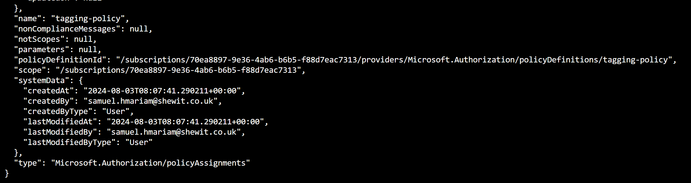
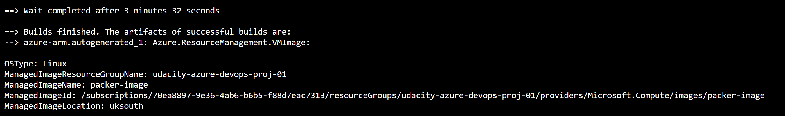

# Azure Infrastructure Operations Project: Deploying a scalable IaaS web server in Azure

### Introduction
For this project, you will write a Packer template and a Terraform template to deploy a customizable, scalable web server in Azure.

### Getting Started
1. Clone this repository
2. Create Azure account
3. Install dependecies listed below

### Dependencies
1. Create an [Azure Account](https://portal.azure.com) 
2. Install the [Azure command line interface](https://docs.microsoft.com/en-us/cli/azure/install-azure-cli?view=azure-cli-latest)
3. Install [Packer](https://www.packer.io/downloads)
4. Install [Terraform](https://www.terraform.io/downloads.html)

### Instructions
1. Create and Apply a Tagging Policy
    - Create policy definition
        `az policy definition create --name tagging-policy --rules policy.json`
    - Apply policy definition to subscription
        `az policy assignment create --name tagging-policy --policy tagging-policy`
    - Verify policy assignment
        `az policy assignment list`
        

2. Create a Server Image
    - Create an Azure Service Principal
        `az ad sp create-for-rbac --role Contributor --scopes /subscriptions/<subscription_id> --query "{ client_id: appId, client_secret: password, tenant_id: tenant }"`
    - Replace placeholders <client_id>, <client_secret>, and <subscription_id> with your actual values in server.json.pkr.hcl
    - Build a packer image
        `packer init server.json.pkr.hcl`
        `packer build server.json.pkr.hcl`
        

3. Create the Infrastructure 
    - Initialize the configuration
        `terraform init`
    - Check the consistency of configuration files
        `terraform validate`
    - Create execution plan
        `terraform plan -out solution.plan`
    - Apply the saved plan 
        `terraform apply solution.plan`
        
    - Destroy created resources
        `terraform destroy`

# Customizing Terraform Template
    To customize the terraform template to your needs and requirements, you will need to amend the vars.tf file.

# Output
    The output from running the terraform template is the load balancer URL.
